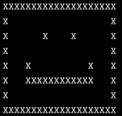

# Pixel Smile

This TypeScript program supposed to create pixel art outputting a smiling face to the console, but there were many errors and it didn't work. Until now...

The purpose of this program is to leverage TypeScript’s type system to fix bugs and guide in implementing the missing functions. After debugging, the expected output is a smiling face outputting to the console while at the same having the opportunity to create art in a fun way.

** <i>project sourced from Codecademy's TypeScript course</i>

---

